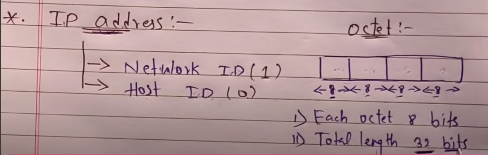
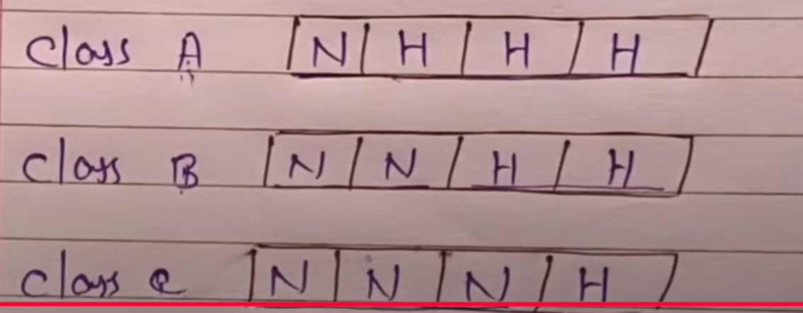
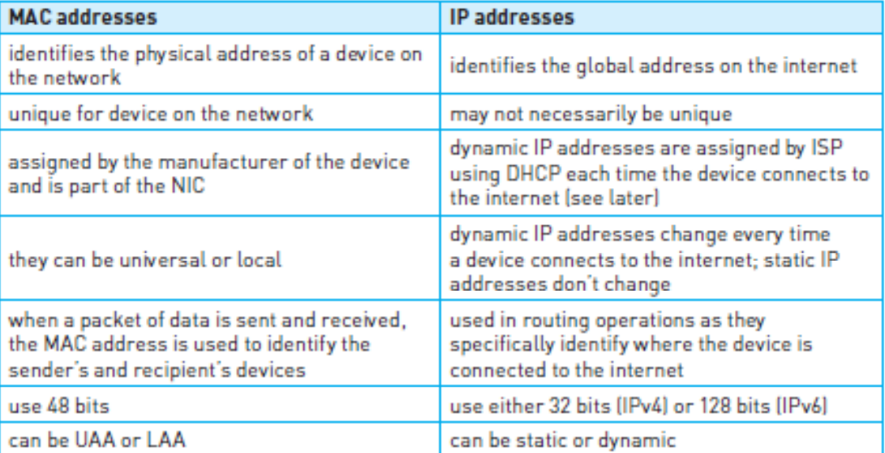
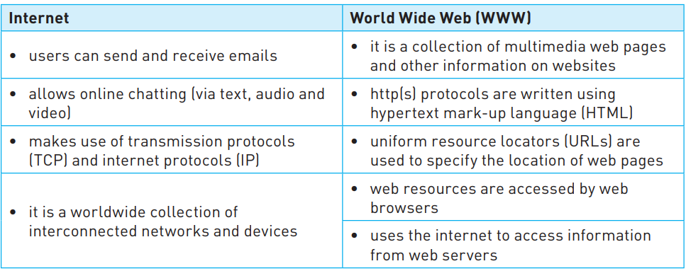

# Computer Networks:

## Table of Content

1. What is NIC
2. MAC Address
3. Ip Address

## 1. NIC

NIC stands for Network Interface Card. It is hardware device without which we cannot connect computer to the network/internet. It contains **MAC (Media access control)** address generated at the manufacturing stage.

WNICs Wireless Network Interface Card are the same as NICs in that they are used to connect devices to the internet or the other network. However they used wireless connectivity utilising an antena to communicate with networks via microwaves. They would normally plug into USB or part of an integrated circuits.

## 2. Media Access Control (MAC) Address:

MAC stands for Media Access Control. It is also known as for physical or hadware address. MAC address is unique and permanent for all electronic or network devices.

### Key Characteristics:

- Refer to the NIC which is part of the device.
- Rarely be changed.
- 12 Digit Hexadecimal Number
- Contains 48 bits
- First 6 digit for Manufacture.
- Last 6 digit for Devices.

### MAC address format

1. MM:MM:MM:DD:DD:DD `00:1C:B3:4F:25:FF` -> Apple
2. MM.MM.MM.DD.DD.DD `00:1C:B3:4F:25:FF` -> Apple

**Note:\*** If the NIC is changed, the MAC will also change.

### Types of MAC address:

- **UAA (Universally Administered):** Manufacturer-assigned, globally unique, with a "0" in the second-least-significant bit of the first byte.
- **LAA (Locally Administered):** Manually assigned by an administrator, with a "1" in the second-least-significant bit of the first byte.

**Note:\***

We can change a Locally Administered MAC Address (LAA), not the Universally Administered MAC Address (UAA) set by the manufacturer.

### Reasons to Change a MAC Address:

Privacy: Prevent tracking on public networks.
Network Requirements: Some networks use specific MAC addresses for access.
Conflict Resolution: Unique LAAs prevent address conflicts on the same network.
Testing: Simulate different devices on a network.
Changing to an LAA is useful for privacy, custom configurations, and troubleshooting but should be done carefully to avoid compatibility issues.

## Ip Address

- IP Address stands for Internet Protocol Address.An IP address is a unique numerical identifier assigned to each device connected to a network.
- It is in the form of four integeric number which is separated by dots.
- Example: `192.168.0.1`

### Types of IP Address:

- IPv4
  - Length 32 bits
  - 4 Octets (Every octect has 8 bits) 8\*4 = 32
  - Range: 0 to 255
  - 4 Billion Devices support (
232
)
  - e.g: `192.168.0.1`
- IPv6
  - Length 128 bits
  - 8 Octets (Every octect has 16 bits) 8\*16 = 128
  - Range: 0 to FFFF (65535)
  - 340 trillion Devices support (
2128
)
  - e.g: `2001:0db8:85a3:0000:0000:8a2e:0370:7334`

### Types of IP Addresses Based on Scope:

- **Public IP:** Used to identify devices on the wider internet; unique and assigned by ISPs.
- **Private IP:** Used within a local network, not accessible from the internet (e.g., 192.168.x.x in home networks).

---

IP addresses are divided into classes to organize networks of different sizes. In **IPv4**, IP addresses are categorized into five main classes: **A, B, C, D, and E**. Each class has a specific range and purpose.

### Classes of IPv4 Addresses:

| **Class** | **Range**                    | **Network/Host Bits** | **Purpose**           | **Example**        |
| --------- | ---------------------------- | --------------------- | --------------------- | ------------------ |
| **A**     | 1.0.0.0 to 126.0.0.0         | 8 network / 24 host   | Large networks        | `10.0.0.1`         |
| **B**     | 128.0.0.0 to 191.255.0.0     | 16 network / 16 host  | Medium-sized networks | `172.16.0.1`       |
| **C**     | 192.0.0.0 to 223.255.255.0   | 24 network / 8 host   | Small networks        | `192.168.1.1`      |
| **D**     | 224.0.0.0 to 239.255.255.255 | Not divided           | Multicasting          | `224.0.0.1`        |
| **E**     | 240.0.0.0 to 255.255.255.255 | Not divided           | Experimental/Reserved | Reserved addresses |

**Note\*:** IP `127.0.0.1` is reserved as the loopback address (Local Server)

### Explanation of Each Class:

- **Class A**: Supports a large number of hosts; suitable for very large networks.
- **Class B**: Used by medium-sized networks, such as large organizations.
- **Class C**: Commonly used by small networks, like home networks.
- **Class D**: Reserved for multicast groups, allowing data to be sent to multiple destinations.
- **Class E**: Reserved for experimental purposes and not used in mainstream networking.

### Private IP Ranges (for Classes A, B, and C):

Some IP ranges within Classes A, B, and C are reserved for private networks:

- **Class A**: `10.0.0.0 to 10.255.255.255`
- **Class B**: `172.16.0.0 to 172.31.255.255`
- **Class C**: `192.168.0.0 to 192.168.255.255`

These private IPs are commonly used in internal networks and are not routable on the internet.

Network ID and Host ID

## Difference Between IPv4 and IPv6

| **Feature**         | **IPv4**                                             | **IPv6**                                                                                      |
| ------------------- | ---------------------------------------------------- | --------------------------------------------------------------------------------------------- |
| **Address Length**  | 32 bits (shorter)                                    | 128 bits (much longer)                                                                        |
| **Format**          | Four numbers separated by dots (e.g., `192.168.1.1`) | Eight groups of numbers separated by colons (e.g., `2001:0db8:85a3:0000:0000:8a2e:0370:7334`) |
| **Total Addresses** | About 4 billion addresses                            | Virtually unlimited addresses                                                                 |
| **Usage**           | Currently the most common                            | Newer, designed to eventually replace IPv4                                                    |
| **Setup**           | Needs manual or DHCP configuration                   | Can automatically configure itself                                                            |
| **Security**        | Security is optional                                 | Built-in security features                                                                    |

### In Short:

- **IPv4**: The old standard with limited addresses, common today.
- **IPv6**: The new standard, much larger, with built-in security and automatic setup.

## Difference between static and dynamic IP address

| **Feature**       | **Static IP Address**                                   | **Dynamic IP Address**                                              |
| ----------------- | ------------------------------------------------------- | ------------------------------------------------------------------- |
| **Definition**    | A fixed IP address that doesn’t change over time        | An IP address that is temporarily assigned and can change over time |
| **Assignment**    | Manually set by an administrator                        | Assigned automatically by a DHCP server                             |
| **Stability**     | Always remains the same                                 | Can change each time a device connects to the network               |
| **Use Cases**     | Ideal for servers, remote access, and business networks | Commonly used for home devices and personal use                     |
| **Cost**          | Often costs more with ISPs                              | Usually included in standard internet service                       |
| **Advantages**    | Consistent for remote access and hosting                | Easier to set up and automatically managed                          |
| **Disadvantages** | Less private and potentially more vulnerable to hacking | Can disrupt remote connections if the IP changes                    |

### In Short:

- **Static IP**: Doesn’t change, good for businesses and servers.
- **Dynamic IP**: Changes over time, commonly used for home networks due to ease and low cost.

## Difference Between MAC address and IP Address

| **Feature**       | **MAC Address**                                                    | **IP Address**                                                                             |
| ----------------- | ------------------------------------------------------------------ | ------------------------------------------------------------------------------------------ |
| **Full Form**     | Media Access Control                                               | Internet Protocol                                                                          |
| **Function**      | Identifies a device on a local network (physical address)          | Identifies a device on a network or the internet (logical address)                         |
| **Format**        | 48-bit address, written in hexadecimal (e.g., `00:1A:2B:3C:4D:5E`) | IPv4: 32-bit (e.g., `192.168.1.1`), IPv6: 128-bit (e.g., `2001:0db8:85a3::8a2e:0370:7334`) |
| **Assigned By**   | Assigned by the manufacturer of the network device                 | Assigned by an ISP or network administrator (via DHCP or static configuration)             |
| **Uniqueness**    | Unique to each device (hard-coded)                                 | Unique per network but can change (especially with dynamic IPs)                            |
| **Changeability** | Typically cannot be changed (except locally administered MACs)     | Can be changed, especially with dynamic IPs (DHCP)                                         |
| **Scope**         | Local network (LAN)                                                | Can be public (on the internet) or private (within a local network)                        |

### In Short:

- **MAC Address**: Unique identifier for a device on a local network (hardware address).
- **IP Address**: Identifies a device on a network or the internet, used for routing data (logical address).

---

**Network security** refers to the practices, policies, and technologies used to protect the integrity, confidentiality, and availability of computer networks and their data. The goal is to prevent unauthorized access, misuse, modification, or denial of network resources.

### Key Aspects of Network Security:

1. **Confidentiality**: Ensuring that data is accessible only to authorized users and not exposed to unauthorized access.

2. **Integrity**: Ensuring that data is accurate and has not been tampered with during transmission or storage.

3. **Availability**: Ensuring that network services and data are available when needed, without disruptions.

### Key Components of Network Security:

1. **Firewalls**: Monitor and control incoming and outgoing network traffic based on predetermined security rules.

2. **Intrusion Detection Systems (IDS) / Intrusion Prevention Systems (IPS)**: Detect and respond to suspicious or malicious network activities.

3. **Encryption**: Protects data by converting it into a code that can only be deciphered by authorized parties, ensuring secure transmission over networks.

4. **Antivirus and Anti-malware Software**: Protects networks from harmful software that can compromise data or disrupt network functions.

5. **Access Control**: Defines and limits who can access specific network resources, often using methods like passwords, biometrics, and multi-factor authentication.

6. **Virtual Private Networks (VPNs)**: Securely connect remote users or offices to a network over the internet, encrypting the traffic between them.

7. **Network Segmentation**: Divides a network into smaller, isolated sections to contain potential security threats and limit damage in case of a breach.

### In Short:

Network security is about protecting networks and data from unauthorized access, attacks, and disruptions, ensuring that only legitimate users and devices can access the resources they need.

---

Here's a breakdown of the terms related to the internet and web technologies:

### 1. **Internet**:

- The internet is a global network of computers and servers connected to each other, allowing the sharing of information and communication. It enables access to websites, email services, social media, and other online resources.

### 2. **WWW (World Wide Web)**:

- The WWW is a system of interlinked hypertext documents and multimedia content accessed through the internet using web browsers. It is just one of the many services provided by the internet, allowing people to view websites, interact with content, and access services.

### 3. **URLs (Uniform Resource Locators)**:

- A URL is the address used to access resources on the web. It consists of several components:
  - **Protocol** (e.g., `http://` or `https://`)
  - **Domain Name** (e.g., `www.example.com`)
  - **Path** (e.g., `/path/to/resource`)
  - **Query Parameters** (optional, e.g., `?id=123`)

### 4. **HTTP (HyperText Transfer Protocol)**:

- HTTP is a protocol used for transferring data over the web. It defines how messages are formatted and transmitted between web servers and browsers. It is the foundation of data communication on the World Wide Web.

### 5. **HTTPS (HyperText Transfer Protocol Secure)**:

- HTTPS is an extension of HTTP but with added security through encryption. It ensures that data exchanged between the web server and browser is encrypted and secure, typically using SSL/TLS encryption, to prevent eavesdropping and tampering.

### 6. **Web Browser**:

- A web browser is a software application used to access and view websites on the internet. Popular browsers include Google Chrome, Mozilla Firefox, Safari, and Microsoft Edge. They interpret HTML, CSS, and JavaScript to display web pages.

### 7. **DNS (Domain Name System)**:

- DNS is a system that translates domain names (e.g., `www.example.com`) into IP addresses (e.g., `192.168.1.1`), allowing browsers to find the correct server hosting a website.

### 8. **Cookies**:

- Cookies are small pieces of data stored on a user's device by websites. They are used to remember user preferences, login credentials, and other settings between sessions, making the browsing experience more personalized.

### 9. **Session Cookies**:

- Session cookies are temporary cookies that are stored in the browser's memory only for the duration of a browsing session. Once the user closes the browser, the session cookie is deleted. They are commonly used for managing user sessions, like keeping you logged in during a visit.

### 10. **Persistent Cookies**:

- Persistent cookies are stored on the user's device even after the browser is closed. They have an expiration date and can remain on the device for days, months, or even years. These are used for things like remembering login details or tracking users for analytics across sessions.

In short:

- **Internet** connects devices globally.
- **WWW** is a service for accessing web content.
- **URLs** are the addresses for web resources.
- **HTTP** and **HTTPS** define how web communication works, with HTTPS being more secure.
- **Web browsers** are tools to access the web.
- **DNS** translates domain names into IP addresses.
- **Cookies** store data, with session cookies being temporary and persistent cookies staying on the device longer.
